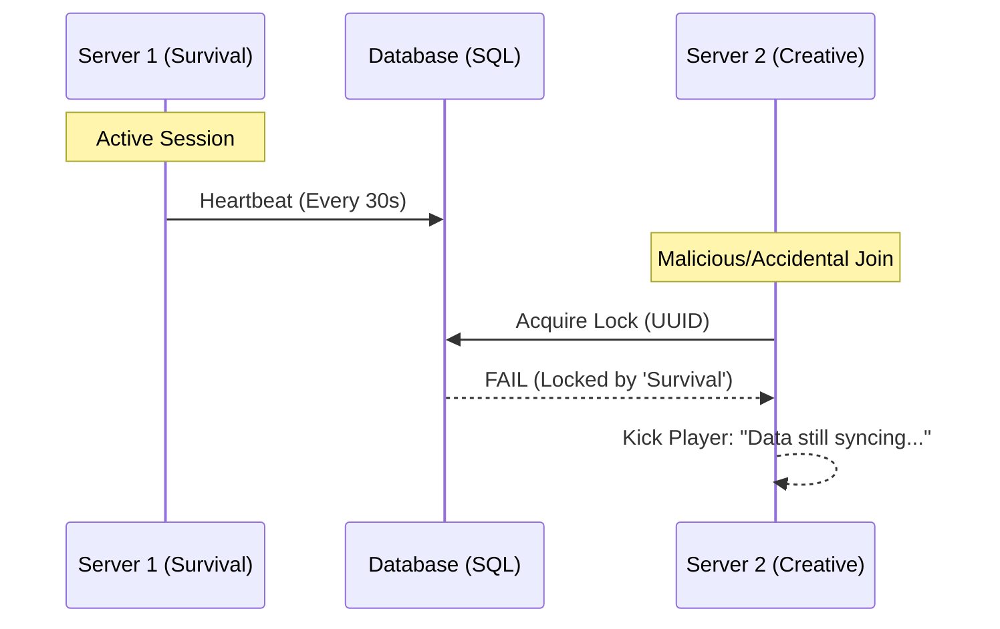
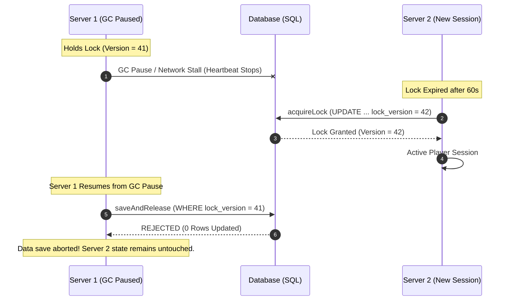

# MC Data Bridge - Technical Architecture & Configuration Guide

This document provides a comprehensive technical overview of MC Data Bridge's distributed concurrency model, configuration parameters, and relational database schema.

---

## 🛠 Distributed Concurrency & Locking Engine

MC Data Bridge is built with a **Security-First** approach to player state. It uses SHA-256 data checksums to prevent manual database tampering, a Proxy-orchestrated handshake to eliminate data loss, and **Server-Side Salting** (via a configurable `security.seed`) to protect against rainbow table and pre-computation attacks on player identities.

### 1. The Secure Handshake (Happy Path)

The Proxy (Bungee/Velocity) acts as the coordinator. It ensures the Source Server has successfully committed data to the database and released its lock before the Destination Server is even allowed to request it.

```mermaid
sequenceDiagram
    autonumber
    actor User
    participant P as Proxy (Velocity/Bungee)
    participant S1 as Source Server
    participant DB as Database (SQL)
    participant S2 as Destination Server

    User->>P: /server survival
    par Signal & Switch
        P->>S1: Plugin Message: "SaveAndRelease"
        P->>S2: Connect User
    end

    rect rgb(35, 35, 35)
        Note over S1, DB: Async Save Process
        S1->>DB: UPDATE data... (Save)
        S1->>DB: UPDATE is_locked=0 (Release)
    end

    rect rgb(45, 20, 20)
        Note over S2, DB: Pre-Login Guard
        loop Polling Lock (Max 10s)
            S2->>DB: Attempt Acquire Lock (UPDATE ...)
            alt Lock Acquired
                DB-->>S2: Success
                Note over S2: Break Loop
            else Locked by S1
                DB-->>S2: Fail (Rows = 0)
                S2-->>S2: Sleep 500ms
            end
        end
    end

    S2->>DB: SELECT data (Load)
    DB-->>S2: Return Player Data
    S2-->>User: Join Successful
```



### 2. Anti-Duplication & Race Condition Protection

By using a **Database-Level Locking Mechanism**, we prevent the "Double-Login" exploit. If a player somehow exists on two servers simultaneously, the second server will be denied access to the data until the first server safely disconnects.



### 3. Distributed Lock Fencing & Stale Write Rejection

To protect against delayed writes (e.g., long GC pauses, scheduler stalls, or network partitioning), MC Data Bridge assigns a monotonic generation token (`lock_version`) on lock acquisition. Any save attempt with an outdated `lock_version` is automatically rejected by SQL.



### 4. Crash Resilience & Auto-Recovery

If a backend server crashes, the player's data lock might remain "Stuck." MC Data Bridge handles this gracefully via a configurable `lock-timeout` (Default: 60s). This ensures players aren't permanently locked out of the network while maintaining a safe window for the database to settle.

```mermaid
sequenceDiagram
    autonumber
    participant P as Player
    participant S1 as Old Server (Crashed)
    participant DB as Database (SQL)
    participant S2 as New Server

    Note over S1, DB: Active Lock (Timestamp: T0)
    S1-xDB: Heartbeat Stops (Crash)

    Note over P, S2: Player Reconnects after 60s
    P->>S2: Join Attempt
    S2->>DB: Check Lock (Timestamp < T - 60s)
    DB-->>S2: Lock Expired

    rect rgb(35, 35, 35)
        Note over S2, DB: Auto-Recovery
        S2->>DB: Override & Acquire Lock (Steal Lock)
        S2->>DB: SELECT data (Load Data)
        DB-->>S2: Return Data Snapshot
    end

    S2-->>P: Join Successful
```



---

## ⚙️ Complete Configuration (`config.yml`) Reference

```yaml
# MySQL Database Configuration
database:
  type: mysql
  host: localhost
  port: 3306
  database: minecraft
  username: user
  password: password
  sqlite-file: "player_data.db"
  serialization-format: "json" # "json" or "binary"

  # JDBC properties (e.g., useSSL: true)
  properties:
    useSSL: false
    allowPublicKeyRetrieval: true

  # HikariCP Connection Pool Settings
  pool-settings:
    maximum-pool-size: 10
    minimum-idle: 10
    max-lifetime: 1800000 # 30 minutes
    connection-timeout: 5000 # 5 seconds
    idle-timeout: 600000 # 10 minutes

  # MySQL JDBC Optimizations
  optimizations:
    cache-prep-stmts: true
    prep-stmt-cache-size: 250
    prep-stmt-cache-sql-limit: 2048
    use-server-prep-stmts: true
    use-local-session-state: true
    rewrite-batched-statements: true
    cache-result-set-metadata: true
    cache-server-configuration: true
    elide-set-auto-commits: true
    maintain-time-stats: false

# A unique name for this server. CRITICAL for data locking!
server-id: "default-server"

# Prefix for database tables
table-prefix: ""

# Time in ms before a lock is considered expired (if server crashes)
lock-timeout: 60000

# Heartbeat interval for lock updates (seconds)
lock-heartbeat-seconds: 30

# Toggle specific data to sync
sync-data:
  health: true
  food-level: true
  experience: true
  inventory: true
  armor: true
  potion-effects: true
  ender-chest: true
  advancements: true
  statistics: true
  pdc: true
  flight-gamemode: true
  companions: false
  maps: false
  separate-gamemode-inventories: false

# Map Synchronization Settings
maps:
  lock-global-maps: false

# Companion / Pet Sync Settings
companions:
  scan-radius: 32
  mode: "follow" # "follow", "return", or "untracked"

# Security Settings
security:
  seed: "change-me-to-a-long-random-string"
  log-uuid-mismatches: true
  verify-data-integrity: true

# Identity & Migration Settings
identity:
  mode: PREMIUM # PREMIUM or HYBRID
  auto-migrate-fastlogin: false
  auto-migrate-authme: false

# Prometheus Metrics Settings
metrics:
  enabled: false
  port: 8080
  path: "/metrics"

# Blacklist servers/worlds from syncing
sync-blacklist:
  servers:
    - "example-server"
  worlds:
    - "example_nether"
```

### Configuration Property Breakdown

- **`database.type`**: `mysql` (MariaDB/MySQL) or `sqlite` (local file).
- **`database.pool-settings`**: Tunable connection pool limits for network size.
- **`server-id` (Required)**: Unique identifier per backend Paper/Folia instance.
- **`lock-timeout`**: Expiration window for orphaned locks if a server crashes.
- **`sync-data.*`**: Granular feature toggles for every player attribute.
- **`security.seed`**: Server salt used for cryptographic HMAC-SHA256 & snapshot checksums.
- **`identity.mode`**: `PREMIUM` (strict UUID enforcement) or `HYBRID` (cracked/migration support).

---

## 📊 Relational Database Schema Breakdown

In addition to the primary tracking table (`player_data`), MC Data Bridge uses component tables to minimize database write amplification.

### Core Lock Registry: `player_data`

| Column              | Type         | Description                                            |
| :------------------ | :----------- | :----------------------------------------------------- |
| `uuid`              | VARCHAR(36)  | The player's Unique ID (Primary Key).                  |
| `data`              | LONGBLOB     | Serialized binary snapshot (legacy fallback).          |
| `data_checksum`     | VARCHAR(64)  | SHA-256 integrity hash of legacy data packet.          |
| `is_locked`         | BOOLEAN      | Prevents concurrent writes from multiple servers.      |
| `locking_server`    | VARCHAR(255) | Server ID currently holding active lock.               |
| `lock_timestamp`    | BIGINT       | Heartbeat timestamp to detect orphaned locks.          |
| `lock_version`      | BIGINT       | Monotonic fencing token counter (stale write guard).   |
| `snapshot_checksum` | VARCHAR(64)  | Canonical SHA-256 hash across normalized components.   |
| `last_known_name`   | VARCHAR(16)  | Used for identity tracking and account migration.      |
| `identity_hash`     | VARCHAR(64)  | Salted HMAC-SHA256 hash for identity verification.     |
| `name_last_updated` | BIGINT       | Timestamp when player's name was last updated.         |
| `last_updated`      | TIMESTAMP    | Auto-updated timestamp of last lock state change.      |

### Component Tables

- **`databridge_inventories`**: Serialized inventory, armor, and ender chest items.
- **`databridge_statistics`**: Health, food, XP, and vanilla statistics JSON.
- **`databridge_metadata`**: Custom PDC metadata and advancement progress.
- **`databridge_companions`**: Companion entity metadata and sitting states.
- **`databridge_maps`**: Map item snapshots and canvas byte renderers.
- **`databridge_gamemode_inventories`**: Separate per-gamemode profiles.
