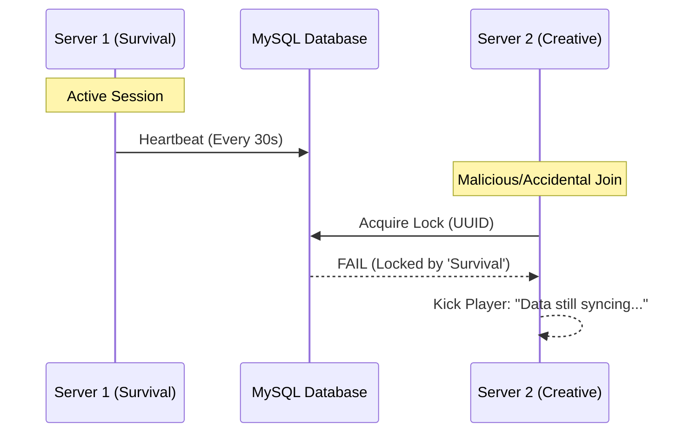
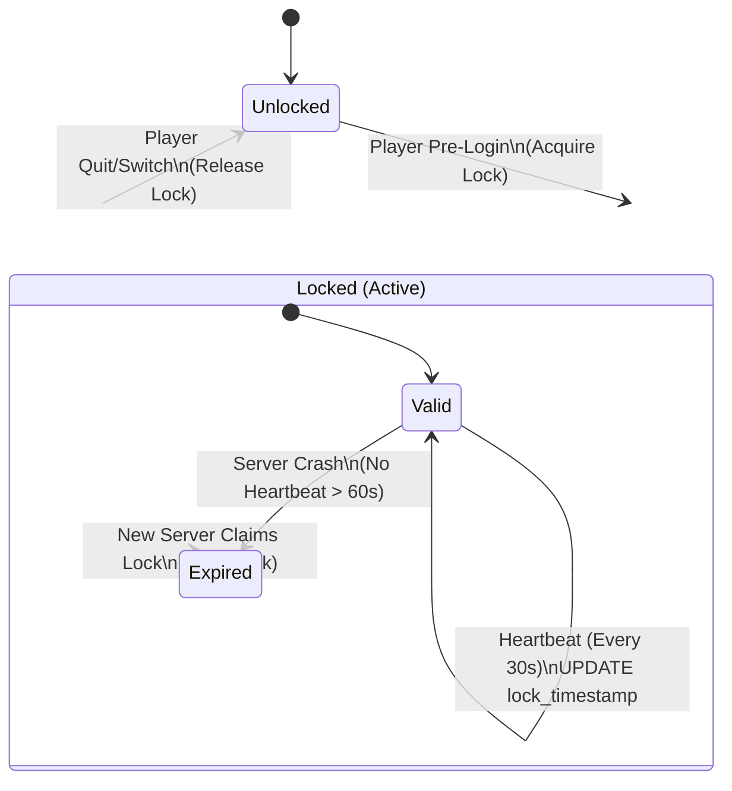

# MC Data Bridge


[](https://modrinth.com/plugin/mc-data-bridge)
[](https://www.spigotmc.org/resources/128642)

MC Data Bridge is a robust, high-performance hybrid plugin for PaperMC (Spigot), BungeeCord, and Velocity. It is designed to seamlessly synchronize player data across multiple Minecraft servers, ensuring that players have a consistent experience by retaining their health, hunger, experience, inventory, and more as they move between linked servers.

## Compatibility

- **Minecraft Version:** `1.21.x`
- **Server Platforms:** PaperMC (or forks like Purpur), Spigot
- **Proxy Platforms:** BungeeCord, Velocity

This plugin is a hybrid build and the same JAR file works on all supported platforms.

## Features

- **Hybrid Plugin:** A single JAR file works on your PaperMC/Spigot servers and your BungeeCord/Velocity proxy, automatically activating the correct functionality for each platform.
- **Proxy-Initiated Saves:** The proxy (BungeeCord/Velocity) orchestrates the data saving process, ensuring that a player's data is saved from their source server _before_ they connect to the destination server. This eliminates race conditions and ensures data is never lost during a server switch.
- **Fully Asynchronous:** All database operations are performed on a separate thread, ensuring that your server's main thread is never blocked. This means no lag, even if your database is slow to respond.
- **Robust Locking Mechanism:** A database-level locking mechanism with an automatic timeout prevents data corruption and ensures that only one server can write a player's data at a time.
- **Version-Independent Item Serialization:** Player inventories are serialized using Minecraft's built-in Base64 methods, which is highly robust and prevents data loss when you update your Minecraft server to a new version.
- **Cross-Server Player Data Sync:** Synchronizes core player data including:
  - Health
  - Food Level & Saturation
  - Experience (Total XP, current XP, and Level)
  - Inventory Contents
  - Armor Contents
  - Active Potion Effects
  - **Ender Chest Contents**
  - **Advancements & Recipes**
- **Resilient Connection Pooling:** Uses HikariCP with optimized settings to ensure that the database connection is resilient to network issues and database restarts.
- **Granular Sync Control**: Enable or disable synchronization for any specific data type via `config.yml`.
- **Server/World Blacklist**: Prevent synchronization on specific servers or worlds.
- **Configurable Table Names**: Set a custom prefix for database tables to avoid conflicts.
- **Configurable & Flexible:** Easily connect to your MySQL database and configure settings for your server environment.

## Installation

1.  **Build the Plugin:**
    - Navigate to the plugin's root directory in your terminal.
    - Run `mvn clean package` to build the plugin.
    - The compiled JAR file (`mc-data-bridge-*.jar`) will be located in the `target/` directory.
    - **Note**: Development builds will end in `-SNAPSHOT`. Release builds (from the `main` branch tags) will just be the version number.
2.  **Deploy to Servers:**
    - Copy the single `mc-data-bridge-*.jar` file into the `plugins/` folder of **each PaperMC server** you wish to synchronize.
    - Copy the **same JAR file** into the `plugins/` folder of your **BungeeCord or Velocity proxy server**.

---

## 🛠 Technical Deep Dive

MC Data Bridge is built with a **Security-First** approach to player state. Unlike traditional sync plugins that rely on simple "Save-on-Quit," this plugin utilizes a Proxy-orchestrated handshake to eliminate data loss and duplication exploits.

### 1. The Secure Handshake (Happy Path)

The Proxy (Bungee/Velocity) acts as the coordinator. It ensures the Source Server has successfully committed data to the MySQL database and released its lock before the Destination Server is even allowed to request it.

```mermaid
sequenceDiagram
    autonumber
    actor User
    participant P as Proxy (Velocity/Bungee)
    participant S1 as Source Server
    participant DB as MySQL Database
    participant S2 as Destination Server

    User->>P: /server survival
    par Signal & Switch
        P->>S1: Plugin Message: "SaveAndRelease"
        P->>S2: Connect User
    end

    rect rgb(35, 35, 35)
        Note over S1, DB: Async Save Process
        S1->>DB: UPDATE data... (Save)
        S1->>DB: UPDATE is_locked=0 (Release)
    end

    rect rgb(45, 20, 20)
        Note over S2, DB: Pre-Login Guard
        loop Polling Lock (Max 10s)
            S2->>DB: Attempt Acquire Lock (UPDATE ...)
            alt Lock Acquired
                DB-->>S2: Success
                Note over S2: Break Loop
            else Locked by S1
                DB-->>S2: Fail (Rows = 0)
                S2-->>S2: Sleep 500ms
            end
        end
    end

    S2->>DB: SELECT data (Load)
    DB-->>S2: Return Player Data
    S2-->>User: Join Successful
```



### 2. Anti-Duplication & Race Condition Protection

By using a **Database-Level Locking Mechanism**, we prevent the "Double-Login" exploit. If a player somehow exists on two servers simultaneously, the second server will be denied access to the data until the first server safely disconnects.



### 3. Crash Resilience & Auto-Recovery

If a backend server crashes, the player's data lock might remain "Stuck." MC Data Bridge handles this gracefully via a configurable `lock-timeout` (Default: 60s). This ensures players aren't permanently locked out of the network while maintaining a safe window for the database to settle.



## Configuration

A `config.yml` file will be generated in the `plugins/mc-data-bridge/` folder on your PaperMC servers after the first run. You must update this file with your database credentials and a unique server ID.

```yaml
# MySQL Database Configuration
database:
  host: localhost
  port: 3306
  database: minecraft
  username: user
  password: password

  # A list of JDBC properties to apply.
  # This is where you would enable SSL (e.g., useSSL: true)
  properties:
    useSSL: false
    allowPublicKeyRetrieval: true

  # HikariCP Connection Pool Settings
  pool-settings:
    maximum-pool-size: 10
    minimum-idle: 10
    max-lifetime: 1800000 # 30 minutes
    connection-timeout: 5000 # 5 seconds
    idle-timeout: 600000 # 10 minutes

  # MySQL JDBC Optimizations
  optimizations:
    cache-prep-stmts: true
    prep-stmt-cache-size: 250
    prep-stmt-cache-sql-limit: 2048
    use-server-prep-stmts: true
    use-local-session-state: true
    rewrite-batched-statements: true
    cache-result-set-metadata: true
    cache-server-configuration: true
    elide-set-auto-commits: true
    maintain-time-stats: false

# Set to true to enable verbose debugging messages in the server console.
debug: false

# A unique name for this server. This is CRITICAL for data locking.
# Each server connected to the same database MUST have a unique name.
# Example: "survival-1", "creative", "lobby"
# Example: "survival-1", "creative", "lobby"
server-id: "default-server"

# Set to prefix the player_data table (e.g., 'mc_data_bridge_'). Leave empty for default.
table-prefix: ""

# The duration in milliseconds after which a player data lock is considered expired.
# This prevents players from being permanently locked out if a server crashes.
# Default: 60000 (1 minute)
lock-timeout: 60000

# Heartbeat interval for lock updates (seconds)
lock-heartbeat-seconds: 30

# Toggle specific data to sync
sync-data:
  health: true
  food-level: true
  experience: true
  inventory: true
  armor: true
  potion-effects: true
  ender-chest: false
  location: false # Logging only
  advancements: false

# Blacklist servers/worlds from syncing
sync-blacklist:
  servers:
    - "example-server"
  worlds:
    - "example_nether"
```

- **`database.*`**: Standard configuration for your MySQL database connection.
- **`debug`**: Set to `true` to enable verbose debugging messages in the server console. Set to `false` for normal operation.
- **`server-id` (Required):** You **must** set a unique name for each of your PaperMC/Spigot servers. This is critical for the data locking system to work correctly. The proxy server does not need this configuration.
- **`lock-timeout`**: The time in milliseconds after which a data lock is considered expired. This prevents a player from being permanently locked if a server crashes while saving their data.
- **`sync-data`**: Toggle specific features on/off. New features like `ender-chest` and `advancements` are disabled by default.
- **`sync-blacklist`**: Define servers or worlds where synchronization should be skipped.

## Commands

- `/databridge unlock <player>` - Manually release a lock for a specific player (Permission: `databridge.admin`).

## Usage

1.  **Add the JAR:** Place the single `mc-data-bridge-*.jar` file into the `plugins/` folder of all your PaperMC servers AND your BungeeCord/Velocity proxy.
2.  **Configure:** Edit the `config.yml` in each PaperMC server's `plugins/mc-data-bridge/` folder. **Set a unique `server-id` for each server.**
3.  **Restart Servers:** Restart your proxy and all backend Minecraft servers.
4.  **Enjoy!** Players can now seamlessly switch between your linked servers, and their data will be synchronized automatically and safely.

## Important Notes

- **Database Requirement:** This plugin requires a **MySQL or MariaDB database** to function.
- **Security Best Practice:** For production servers, it is strongly recommended to create a dedicated MySQL user for this plugin with limited permissions. The user only needs `SELECT`, `INSERT`, `UPDATE`, `CREATE`, and `ALTER` on the specified database.
- **Connectivity & Firewalls:** Ensure your Minecraft servers and proxy can open a network connection to your database's `host` and `port`.
- **Automatic Schema:** The plugin will automatically create and update the `player_data` table in your database. The schema includes `uuid`, `data`, `is_locked`, `locking_server`, `lock_timestamp`, and `last_updated`.
