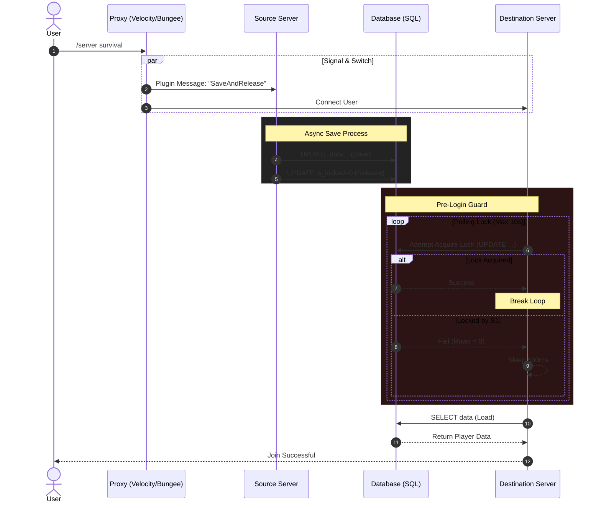
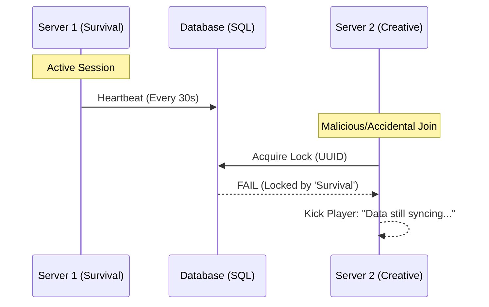
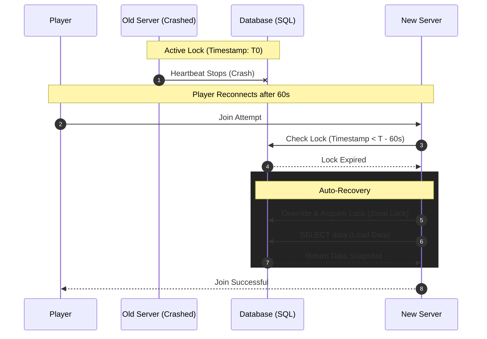

# MC Data Bridge

<br>
[](https://modrinth.com/plugin/mc-data-bridge)[](https://www.spigotmc.org/resources/128642)[](https://github.com/westkevin12/mc-data-bridge/releases)<br>

<br>

MC Data Bridge is a robust, high-performance hybrid plugin for **PaperMC** (and forks like **Purpur**), **Folia**, **Spigot**, **Bukkit**, **BungeeCord** (and forks like **Waterfall**), and **Velocity**. It is designed to seamlessly synchronize player data across multiple Minecraft servers, ensuring that players have a consistent experience by retaining their health, hunger, experience, inventory, and more as they move between linked servers.

## Compatibility

- **Minecraft Version:** `1.21.x` `26.2.x`
- **Server Platforms:** PaperMC, Purpur, Spigot, Bukkit, **Folia**
- **Proxy Platforms:** BungeeCord, Waterfall, Velocity

This plugin is a hybrid build and the same JAR file works on all supported platforms.

## Features

- **Item Duplication Exploit Protection:** Automatically closes open inventory views during server transfer and cancels container clicks, drags, item drops, pickups, and interactions while transfer locks are held.
- **Interactive Inventory & Ender Chest Inspector (`invsee` / `endersee`):** Inspect offline or cross-server player inventories and ender chests.
  - **Overview GUI Controls:** **Left-Click** inventory or ender chest icons to view in Safe Read-Only Mode; **Right-Click** icons to open in Interactive Edit Mode (gated by permission).
  - **Safe View-Only Mode (Default):** Opens in read-only mode to prevent accidental item modifications.
  - **Interactive Edit Mode (`--edit` flag or Right-Click):** Admins with `databridge.inspect.edit` permission can edit offline/cross-server player items directly in the GUI with automatic database persistence upon closing.
- **Full Command Tab Completion:** Comprehensive auto-completion for subcommands, player names, view options, and flags.
- **Auto-Schema Maintenance:** Toggle `auto-update-schema` (default `true`) for automated table maintenance and column upgrades (`LONGTEXT` support for large stats and metadata).
- **Hybrid Plugin:** A single JAR file works on your PaperMC/Purpur/Spigot/Folia servers and your BungeeCord/Waterfall/Velocity proxy, automatically activating the correct functionality for each platform.
- **Identity History Tracking:** Automatically tracks `last_known_name` and a secure `identity_hash` (SHA-256) to enable secure UUID change detection and prevent identity hijacking in hybrid (Cracked/Premium) environments.
- **Identity Modes (PREMIUM/HYBRID):** Toggle between strict UUID enforcement for premium servers or flexible identity shifts for hybrid/cracked networks.
- **FastLogin & AuthMe Auto-Migration:** Automatically migrates player data from offline to premium UUIDs when a player is verified by FastLogin (PreLogin) or AuthMe (Login).
- **TOTP Support:** Compatible with AuthMe's native TOTP/2FA system; auto-migration triggers only after full multi-factor authentication is completed.
- **Folia Support:** Built-in compatibility for Folia's regionalized threading model, ensuring safe operation on high-performance multi-threaded servers.
- **Database Flexibility:** Supports **MySQL**, **MariaDB**, and **SQLite**. Choose the backend that best fits your network size.
- **Proxy-Initiated Saves:** The proxy (BungeeCord/Velocity) orchestrates the data saving process, ensuring that a player's data is saved from their source server _before_ they connect to the destination server. This eliminates race conditions and ensures data is never lost during a server switch.
- **Fully Asynchronous:** All database operations are performed on a separate thread, ensuring that your server's main thread is never blocked. This means no lag, even if your database is slow to respond.
- **Robust Locking Mechanism:** A database-level locking mechanism with an automatic timeout prevents data corruption and ensures that only one server can write a player's data at a time.
- **Version-Independent Item Serialization:** Player inventories are serialized using Minecraft's built-in Base64 methods, which is highly robust and prevents data loss when you update your Minecraft server to a new version.
- **Cross-Server Player Data Sync:** Synchronizes core player data including:
  - Health
  - Food Level, Saturation & Exhaustion
  - Experience (Total XP, current XP, and Level)
  - Inventory & Armor Contents
  - Active Potion Effects
  - Ender Chest Contents
  - Advancements & Recipes
  - **Player Statistics** (Vanilla stats)
  - **Persistent Data Container (PDC)** (Custom metadata from other plugins)
  - **Flight & GameMode** status
  - **Companions & Pets** (Tamed wolves, cats, parrots, etc., with NBT properties and sitting status)
  - **Map Items & Canvas Sync** (Cross-server map canvas sync via `sync-data.maps: true` with configurable map locking via `maps.lock-global-maps`)
  - **Separate Gamemode Inventories** (Opt-in separate profiles for Survival, Creative, Adventure, Spectator)
- **Resilient Connection Pooling:** Uses HikariCP with optimized settings to ensure that the database connection is resilient to network issues and database restarts.
- **Prometheus Metrics Exporter:** Built-in lightweight HTTP server exposing live synchronization performance metrics (sync latency, cache metrics, HikariCP pool status) for Grafana dashboards.
- **Granular Sync Control**: Enable or disable synchronization for any specific data type via `config.yml`.
- **Server/World Blacklist**: Prevent synchronization on specific servers or worlds.
- **Configurable Table Names**: Set a custom prefix for database tables to avoid conflicts.

## Installation

1.  **Build the Plugin:**
    - Navigate to the plugin's root directory in your terminal.
    - Run `mvn clean package` to build the plugin.
    - The compiled JAR file (`mc-data-bridge-*.jar`) will be located in the `target/` directory.
    - **Note**: Development builds will end in `-SNAPSHOT`. Release builds (from the `main` branch tags) will just be the version number.
2.  **Deploy to Servers:**
    - Copy the single `mc-data-bridge-*.jar` file into the `plugins/` folder of **each Minecraft server** (Paper, Spigot, or Folia) you wish to synchronize.
    - Copy the **same JAR file** into the `plugins/` folder of your **BungeeCord or Velocity proxy server**.

---

## 🛠 Technical Deep Dive

MC Data Bridge is built with a **Security-First** approach to player state. It utilizes SHA-256 data checksums to prevent manual database tampering, a Proxy-orchestrated handshake to eliminate data loss, and **Server-Side Salting** (via a configurable `security.seed`) to protect against rainbow table and pre-computation attacks on player identities.

### 1. The Secure Handshake (Happy Path)

The Proxy (Bungee/Velocity) acts as the coordinator. It ensures the Source Server has successfully committed data to the database and released its lock before the Destination Server is even allowed to request it.


```mermaid
sequenceDiagram
    autonumber
    actor User
    participant P as Proxy (Velocity/Bungee)
    participant S1 as Source Server
    participant DB as Database (SQL)
    participant S2 as Destination Server

    User->>P: /server survival
    par Signal & Switch
        P->>S1: Plugin Message: "SaveAndRelease"
        P->>S2: Connect User
    end

    rect rgb(35, 35, 35)
        Note over S1, DB: Async Save Process
        S1->>DB: UPDATE data... (Save)
        S1->>DB: UPDATE is_locked=0 (Release)
    end

    rect rgb(45, 20, 20)
        Note over S2, DB: Pre-Login Guard
        loop Polling Lock (Max 10s)
            S2->>DB: Attempt Acquire Lock (UPDATE ...)
            alt Lock Acquired
                DB-->>S2: Success
                Note over S2: Break Loop
            else Locked by S1
                DB-->>S2: Fail (Rows = 0)
                S2-->>S2: Sleep 500ms
            end
        end
    end

    S2->>DB: SELECT data (Load)
    DB-->>S2: Return Player Data
    S2-->>User: Join Successful
```

### 2. Anti-Duplication & Race Condition Protection

By using a **Database-Level Locking Mechanism**, we prevent the "Double-Login" exploit. If a player somehow exists on two servers simultaneously, the second server will be denied access to the data until the first server safely disconnects.


```mermaid
sequenceDiagram
    participant S1 as Server 1 (Survival)
    participant DB as Database (SQL)
    participant S2 as Server 2 (Creative)

    Note over S1: Active Session
    S1->>DB: Heartbeat (Every 30s)

    Note over S2: Malicious/Accidental Join
    S2->>DB: Acquire Lock (UUID)
    DB-->>S2: FAIL (Locked by 'Survival')
    S2-->>S2: Kick Player: "Data still syncing..."
```

### 3. Crash Resilience & Auto-Recovery

If a backend server crashes, the player's data lock might remain "Stuck." MC Data Bridge handles this gracefully via a configurable `lock-timeout` (Default: 60s). This ensures players aren't permanently locked out of the network while maintaining a safe window for the database to settle.


```mermaid
sequenceDiagram
    autonumber
    participant P as Player
    participant S1 as Old Server (Crashed)
    participant DB as Database (SQL)
    participant S2 as New Server

    Note over S1, DB: Active Lock (Timestamp: T0)
    S1-xDB: Heartbeat Stops (Crash)

    Note over P, S2: Player Reconnects after 60s
    P->>S2: Join Attempt
    S2->>DB: Check Lock (Timestamp < T - 60s)
    DB-->>S2: Lock Expired

    rect rgb(35, 35, 35)
        Note over S2, DB: Auto-Recovery
        S2->>DB: Override & Acquire Lock (Steal Lock)
        S2->>DB: SELECT data (Load Data)
        DB-->>S2: Return Data Snapshot
    end

    S2-->>P: Join Successful
```

## Configuration

A `config.yml` file will be generated in the `plugins/mc-data-bridge/` folder on your backend servers after the first run. You must update this file with your database credentials and a unique server ID.

### Database Settings

You can choose between `mysql` (for MySQL/MariaDB) or `sqlite`.

#### Option A: MySQL / MariaDB (Recommended for Networks)

```yaml
# MySQL Database Configuration
database:
  type: mysql
  host: localhost
  port: 3306
  database: minecraft
  username: user
  password: password

  # A list of JDBC properties to apply.
  # This is where you would enable SSL (e.g., useSSL: true)
  properties:
    useSSL: false
    allowPublicKeyRetrieval: true

  # HikariCP Connection Pool Settings
  pool-settings:
    maximum-pool-size: 10
    minimum-idle: 10
    max-lifetime: 1800000 # 30 minutes
    connection-timeout: 5000 # 5 seconds
    idle-timeout: 600000 # 10 minutes

  # MySQL JDBC Optimizations
  optimizations:
    cache-prep-stmts: true
    prep-stmt-cache-size: 250
    prep-stmt-cache-sql-limit: 2048
    use-server-prep-stmts: true
    use-local-session-state: true
    rewrite-batched-statements: true
    cache-result-set-metadata: true
    cache-server-configuration: true
    elide-set-auto-commits: true
    maintain-time-stats: false
```

#### Option B: SQLite (Recommended for Testing/Single-Machine)

```yaml
database:
  type: sqlite
  sqlite-file: "player_data.db"
```

### Advanced Settings

```yaml
# Set to true to enable verbose debugging messages.
debug: false

# A unique name for this server. This is CRITICAL for data locking.
# Each server connected to the same database MUST have a unique name.
# Example: "survival-1", "creative", "lobby"
server-id: "default-server"

# Set to prefix the player_data table.
table-prefix: ""

# Time in ms before a lock is considered expired (if a server crashes).
lock-timeout: 60000

# Heartbeat interval for lock updates (seconds).
lock-heartbeat-seconds: 30

# Toggle specific data to sync
sync-data:
  health: true
  food-level: true
  experience: true
  inventory: true
  armor: true
  potion-effects: true
  ender-chest: true
  advancements: true
  statistics: true
  pdc: true
  flight-gamemode: true
  companions: false
  maps: true
  separate-gamemode-inventories: false

# Map Synchronization Settings
# To disable map synchronization entirely (e.g. if using a third-party map sync plugin),
# set 'sync-data.maps: false'.
maps:
  # Force map locking (locked = 1) on global maps to prevent local terrain overwrites / Fog of War
  lock-global-maps: true

# Companion/pet sync settings. Requires sync-data.companions: true.
companions:
  scan-radius: 32
  # Synchronization mode: follow, return, untracked
  mode: "follow"

# Security Settings
security:
  # A secret seed used to salt all cryptographic hashes.
  # CHANGE THIS to a long, random string to secure your network.
  seed: "change-me-to-a-long-random-string"
  # Log identity collisions (name-UUID mismatches) to the console.
  log-uuid-mismatches: true
  # Verify data integrity checksums before loading.
  verify-data-integrity: true

# Identity & Migration Settings
identity:
  # PREMIUM: UUID for a name should NEVER change. Collisions require manual /migrate.
  # HYBRID: Allows flexible identity shifts (useful for Cracked -> Premium transitions).
  mode: PREMIUM

  # If true, and FastLogin is installed, the plugin will attempt to
  # auto-migrate data if FastLogin confirms the player is a verified premium user.
  auto-migrate-fastlogin: false

  # If true, and AuthMe is installed, the plugin will attempt to
  # auto-migrate data once the player successfully logs in via AuthMe.
  # This supports AuthMe's native TOTP/2FA as well.
  auto-migrate-authme: false

# Prometheus Metrics Settings
metrics:
  enabled: false
  port: 8080
  path: "/metrics"

# Blacklist servers/worlds from syncing
sync-blacklist:
  servers:
    - "example-server"
  worlds:
    - "example_nether"
```

- **`database.*`**: Standard configuration for your MySQL database connection.
- **`debug`**: Set to `true` to enable verbose debugging messages in the server console. Set to `false` for normal operation.
- **`server-id` (Required):** You **must** set a unique name for each of your PaperMC/Spigot/Folia servers. This is critical for the data locking system to work correctly. The proxy server does not need this configuration.
- **`lock-timeout`**: The time in milliseconds after which a data lock is considered expired. This prevents a player from being permanently locked if a server crashes while saving their data.
- **`sync-data`**: Toggle specific features on/off. Features like `ender-chest`, `advancements`, `statistics`, and `pdc` (metadata) can be customized here.
- **`sync-blacklist`**: Define servers or worlds where synchronization should be skipped.
- **`database.backups`**: Configure the optional local redundancy (JSON export) system.

## Commands

MC Data Bridge uses a consolidated command hub for all administrative tasks.

- `/databridge inspect <player> [inventory|enderchest] [--edit]` - Open a visual GUI to inspect or edit a player's saved data and inventory.
- `/databridge invsee <player> [--edit]` - Directly open a player's saved inventory view or edit GUI.
- `/databridge endersee <player> [--edit]` - Directly open a player's saved ender chest view or edit GUI.
- `/databridge unlock <player>` - Manually release a stuck data lock. Works on Spigot, Folia, Bungee, and Velocity.
- `/databridge migrate <source> <target>` - Securely migrate data from one player (UUID or Name) to another. Useful for account recoveries or identity changes.
- `/databridge reload` - Reload plugin configuration and database connection pool.

**Proxy Commands:**

- `/databridge unlock <player>` - Network-wide data lock release.
- `/databridge forceunlock <player>` - Relays immediate lock drop signal to backend server.

**Aliases:** `/db`  
**Permissions:**

- `databridge.inspect` - Permission to view player data, inventories, and ender chests in safe read-only mode.
- `databridge.inspect.edit` - Elevated permission required to interactively edit inventories/ender chests via `--edit`.
- `databridge.admin` - Full administrative access (includes unlock, migrate, reload, forceunlock, inspect, edit).

## Usage

1.  **Add the JAR:** Place the single `mc-data-bridge-*.jar` file into the `plugins/` folder of all your PaperMC/Folia/Spigot servers AND your BungeeCord/Velocity proxy.
2.  **Configure:** Edit the `config.yml` in each PaperMC/Folia/Spigot server's `plugins/mc-data-bridge/` folder. **Set a unique `server-id` for each server.**
3.  **Restart Servers:** Restart your proxy and all backend Minecraft servers.
4.  **Enjoy!** Players can now seamlessly switch between your linked servers, and their data will be synchronized automatically and safely.

## Important Notes

- **Folia Compatibility:** This plugin is fully compatible with Folia. It uses the `GlobalRegionScheduler` and `EntityScheduler` to ensure thread safety across regions.
- **Platform Parity:** Whether you are running a single Spigot server, a massive Folia cluster, or even a mix of server types on different machines behind a Velocity or Waterfall proxy, MC Data Bridge provides identical features and reliability.
- **Security Best Practice:** For production MySQL servers, use a dedicated user with limited permissions (`SELECT`, `INSERT`, `UPDATE`, `CREATE`, `ALTER`).
- **Backups:** Use the provided configuration documentation to implement true offsite backups.
- **Connectivity & Firewalls:** Ensure your Minecraft servers and proxy can open a network connection to your database's `host` and `port`.
- **Automatic Schema:** The plugin will automatically create and update the `player_data` table. The schema includes `uuid`, `data`, `is_locked`, `locking_server`, `lock_timestamp`, `last_known_name`, `identity_hash`, `name_last_updated`, `data_checksum`, and `last_updated`.
