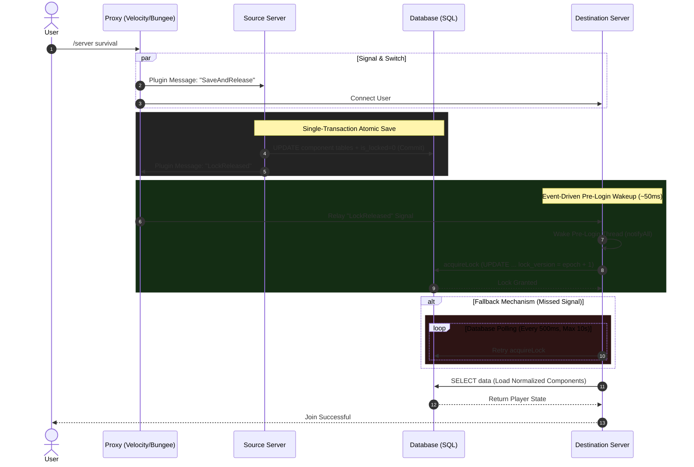
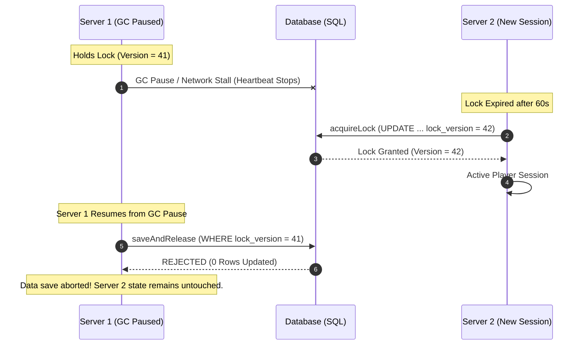

# MC Data Bridge

<br>
[](https://modrinth.com/plugin/mc-data-bridge)[](https://www.spigotmc.org/resources/128642)[](https://github.com/westkevin12/mc-data-bridge/releases)<br>

<br>

MC Data Bridge is a high-performance hybrid plugin for **PaperMC** (and forks like **Purpur**), **Folia**, **Spigot**, **Bukkit**, **BungeeCord** (and forks like **Waterfall**), and **Velocity**. It seamlessly synchronizes player data across linked Minecraft servers with enterprise-grade distributed locks, single-transaction atomic persistence, and instant event-driven messaging.

## Quick Start

1. **Deploy Plugin**: Place the single `mc-data-bridge-*.jar` file into the `plugins/` folder of each Minecraft server (Paper/Folia/Spigot) and your proxy (Velocity/Bungee).
2. **Configure Backend**: Edit `plugins/mc-data-bridge/config.yml` on each backend server:
   - Set a unique `server-id` (e.g. `server-id: "survival-1"`).
   - Configure **MySQL** or **MariaDB** credentials (**Required** for multi-server networks. Need help setting up a database? See [**DATABASE_SETUP.md**](DATABASE_SETUP.md)).
   - Set `security.seed` to a secret random string.
3. **Restart Servers**: Restart your proxy and backend servers. Data synchronization runs automatically.

---

## Features

- **Comprehensive Cross-Server Data Synchronization**: Synchronizes health, food level, saturation, exhaustion, experience, inventory, armor, potion effects, ender chests, advancements, recipes, vanilla statistics, persistent data container (PDC) metadata, flight and gamemode status, companion pets, cross-server maps, and separate gamemode inventory profiles.
- **Item Duplication Exploit Protection**: Automatically closes open inventory views during server transfer and cancels container clicks, drags, item drops, pickups, and interactions while transfer locks are held.
- **Interactive Inventory & Ender Chest Inspector (`invsee` / `endersee`)**: Inspect offline or cross-server player inventories and ender chests in real time. Features safe view-only mode by default and interactive edit mode (`--edit` flag or Right-Click) for admins with automatic database persistence upon GUI close.
- **Hybrid Single-JAR Architecture**: A single JAR file operates on your PaperMC, Folia, Spigot, BungeeCord, and Velocity servers, automatically executing the appropriate platform handlers.
- **Identity Modes & Authentication Auto-Migration**: Toggle between strict `PREMIUM` UUID enforcement or flexible `HYBRID` identity shifts. Automatically migrates player data from offline to premium UUIDs upon verification by FastLogin (PreLogin) or AuthMe (Login, including AuthMe native TOTP/2FA).
- **Identity History & Security Tracking**: Tracks `last_known_name` and a secure `identity_hash` (Keyed HMAC-SHA256) to detect identity hijacking, UUID collisions, and manual database tampering.
- **Distributed Lock Fencing Tokens (`lock_version`)**: Employs monotonic generation counters to fence off stale server writes, ensuring delayed servers (e.g., post-GC pauses or network hiccups) can never overwrite active player sessions.
- **Event-Driven Lock Release Messaging**: Source servers dispatch an instant `LockReleased` signal upon saving player state, waking destination pre-login threads immediately and reducing server-switch lock wait latency to ~50ms (with automatic fallback to database polling).
- **Single-Transaction Atomic Persistence**: Combines normalized component updates (`inventories`, `statistics`, `metadata`, `companions`, `maps`) and lock releases into a single database connection and transaction (`setAutoCommit(false)` ... `commit()`).
- **Normalized Data Integrity Checksums**: Computes canonical SHA-256 integrity hashes across normalized player state components salted with `security.seed` to verify data integrity before loading.
- **Folia Multi-Threading Compatibility**: Uses regionalized schedulers (`GlobalRegionScheduler`, `EntityScheduler`) to guarantee thread safety across Folia's regionalized threading model.
- **Prometheus Metrics Exporter**: Built-in HTTP server exposing real-time synchronization performance metrics (sync latency, cache hit ratios, HikariCP pool status) for Grafana dashboards.
- **Granular Sync & Blacklist Control**: Enable or disable synchronization for any specific data type or exclude specific servers and worlds via `config.yml`.

---

## Technical Deep Dive & Concurrency Workflows

### 1. The Secure Handshake (Happy Path)

The Proxy (Velocity/Bungee) orchestrates server transfers. The Source Server saves data atomically and dispatches an instant `LockReleased` message through the proxy to wake the Destination Server's pre-login thread immediately (~50ms latency), falling back to SQL polling if network messages are dropped.


```mermaid
sequenceDiagram
    autonumber
    actor User
    participant P as Proxy (Velocity/Bungee)
    participant S1 as Source Server
    participant DB as Database (SQL)
    participant S2 as Destination Server

    User->>P: /server survival
    par Signal & Switch
        P->>S1: Plugin Message: "SaveAndRelease"
        P->>S2: Connect User
    end

    rect rgb(35, 35, 35)
        Note over S1, DB: Single-Transaction Atomic Save
        S1->>DB: UPDATE component tables + is_locked=0 (Commit)
        S1->>P: Plugin Message: "LockReleased"
    end

    rect rgb(20, 45, 20)
        Note over S2: Event-Driven Pre-Login Wakeup (~50ms)
        P->>S2: Relay "LockReleased" Signal
        S2->>S2: Wake Pre-Login Thread (notifyAll)
        S2->>DB: acquireLock (UPDATE ... lock_version = epoch + 1)
        DB-->>S2: Lock Granted
    end

    alt Fallback Mechanism (Missed Signal)
        rect rgb(45, 20, 20)
            loop Database Polling (Every 500ms, Max 10s)
                S2->>DB: Retry acquireLock
            end
        end
    end

    S2->>DB: SELECT data (Load Normalized Components)
    DB-->>S2: Return Player State
    S2-->>User: Join Successful
```

### 2. Distributed Lock Fencing & Stale Write Rejection

To protect against delayed writes (e.g., long GC pauses, scheduler stalls, or network partitioning), MC Data Bridge assigns a monotonic generation token (`lock_version`) on lock acquisition. Any save attempt with an outdated `lock_version` is automatically rejected by SQL.


```mermaid
sequenceDiagram
    autonumber
    participant S1 as Server 1 (GC Paused)
    participant DB as Database (SQL)
    participant S2 as Server 2 (New Session)

    Note over S1: Holds Lock (Version = 41)
    S1-xDB: GC Pause / Network Stall (Heartbeat Stops)

    Note over S2: Lock Expired after 60s
    S2->>DB: acquireLock (UPDATE ... lock_version = 42)
    DB-->>S2: Lock Granted (Version = 42)
    S2->>S2: Active Player Session

    Note over S1: Server 1 Resumes from GC Pause
    S1->>DB: saveAndRelease (WHERE lock_version = 41)
    DB-->>S1: REJECTED (0 Rows Updated)
    Note over S1: Data save aborted! Server 2 state remains untouched.
```

---

## Configuration (`config.yml`)

```yaml
# MySQL Database Configuration
database:
  type: mysql
  host: localhost
  port: 3306
  database: minecraft
  username: user
  password: password
  sqlite-file: "player_data.db"
  serialization-format: "json" # "json" or "binary"

  # JDBC properties (e.g., useSSL: true)
  properties:
    useSSL: false
    allowPublicKeyRetrieval: true

  # HikariCP Connection Pool Settings
  pool-settings:
    maximum-pool-size: 10
    minimum-idle: 10
    max-lifetime: 1800000 # 30 minutes
    connection-timeout: 5000 # 5 seconds
    idle-timeout: 600000 # 10 minutes

# A unique name for this server. CRITICAL for data locking!
server-id: "default-server"

# Prefix for database tables
table-prefix: ""

# Time in ms before a lock is considered expired (if server crashes)
lock-timeout: 60000

# Heartbeat interval for lock updates (seconds)
lock-heartbeat-seconds: 30

# Toggle specific data to sync
sync-data:
  health: true
  food-level: true
  experience: true
  inventory: true
  armor: true
  potion-effects: true
  ender-chest: true
  advancements: true
  statistics: true
  pdc: true
  flight-gamemode: true
  companions: false
  maps: false
  separate-gamemode-inventories: false

# Map Synchronization Settings
maps:
  lock-global-maps: false

# Companion / Pet Sync Settings
companions:
  scan-radius: 32
  mode: "follow" # "follow", "return", or "untracked"

# Security Settings
security:
  seed: "change-me-to-a-long-random-string"
  log-uuid-mismatches: true
  verify-data-integrity: true

# Identity & Migration Settings
identity:
  mode: PREMIUM # PREMIUM or HYBRID
  auto-migrate-fastlogin: false
  auto-migrate-authme: false

# Prometheus Metrics Settings
metrics:
  enabled: false
  port: 8080
  path: "/metrics"

# Blacklist servers/worlds from syncing
sync-blacklist:
  servers:
    - "example-server"
  worlds:
    - "example_nether"
```

---

## Commands & Permissions

| Command | Description | Required Permission |
| :--- | :--- | :--- |
| `/databridge inspect <player> [inv\|ender] [--edit]` | Open GUI to view or edit saved player data | `databridge.inspect` (`.edit` for `--edit`) |
| `/databridge invsee <player> [--edit]` | Directly open player inventory view or edit GUI | `databridge.inspect` (`.edit` for `--edit`) |
| `/databridge endersee <player> [--edit]` | Directly open player ender chest view or edit GUI | `databridge.inspect` (`.edit` for `--edit`) |
| `/databridge unlock <player>` | Release a stuck data lock (Works on Spigot, Folia, Bungee, Velocity) | `databridge.admin` |
| `/databridge forceunlock <player>` | Proxy command: force immediate lock drop signal | `databridge.admin` |
| `/databridge migrate <source> <target>` | Move player data between UUIDs or names | `databridge.admin` |
| `/databridge reload` | Reload configuration and reconnect DB pool | `databridge.admin` |

---

## Documentation References

For full technical diagrams, relational database schemas, and SpigotMC wiki pages:
- [**DATABASE_SETUP.md**](DATABASE_SETUP.md) — MySQL & MariaDB Installation Guide (Docker, Linux Host, Firewall & Security Best Practices).
- [**ARCHITECTURE.md**](ARCHITECTURE.md) — Architectural Deep Dive, Complete Sequence Diagrams, and Database Schemas.
- [**DOCUMENTATION.bbcode**](DOCUMENTATION.bbcode) — BBCode Wiki Documentation.
