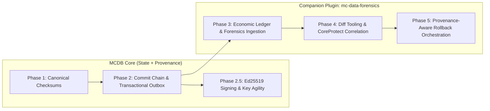

# RFC: State Provenance & Forensic Audit Architecture

**Status**: Draft / Proposed  
**Author**: @westkevin12  
**Created**: 2026-09-13  
**Updated**: 2026-09-17  
**Target Release**: Post-2.3.0 Architecture Exploration

---

## 1. Executive Summary & Core Governing Principle

This document defines the long-term design for **State Provenance, Verifiable Audit Trails, and Forensic State Investigation** within the MC Data Bridge ecosystem.

To preserve core mission discipline, performance, and software maintainability, this architecture establishes an explicit governing principle:

> **MC Data Bridge records facts about authoritative state transitions. MC Data Forensics derives meaning from those facts.**

```text
AUTHORITATIVE FACT (MC Data Bridge Core)
       │
       ▼
Canonical Components
       │
       ▼
State Checksum & Commit Hash Envelope
       │
       ├── Component Deltas (VERIFIED / UNVERIFIED)
       ├── Commit Hash (SHA-256 Envelope)
       └── Evidence & Rejection Events
                │
                ▼
        Transactional Outbox (Same SQL Transaction)
                │
                ▼
        MC DATA FORENSICS (Companion Plugin)
                │
        ┌───────┼────────┐
        ▼       ▼        ▼
      Diff    Ledger   External Evidence (CoreProtect, Logs)
        │       │        │
        └───────┴────────┘
                ▼
          INTERPRETATION (Human Admin / Analytics)
```

---

## 2. Boundary Architecture: "Provenance vs. Forensics"

### 2.1 The Essential Distinction

- **MC Data Bridge (`mc-data-bridge`)**: Answers _"What happened to authoritative state, and can we cryptographically prove the transition?"_
  - Establishes canonical player state, fencing locks (`lock_version`), deterministic component checksums, linear commit hash chains (`commit_id`, `parent_commit_hash`), and tags component deltas as `VERIFIED`, `UNVERIFIED_MODIFICATION`, or `UNKNOWN_ORIGIN`.
  - Maintains authoritative provenance database tables (`databridge_state_commits`, `databridge_state_deltas`, `databridge_provenance_outbox`, `databridge_rejected_operations`).
- **MC Data Forensics (`mc-data-forensics`)**: Answers _"What does all of this evidence tell us about an incident?"_
  - Consumes evidence via the Provenance API and correlates state commits with external logs (CoreProtect, server logs, economic actions).
  - Maintains historical forensic tables (`forensic_investigations`, `economic_transactions`, `clearing_accounts`), which can be fully reconstructed from MC Data Bridge provenance if necessary.
  - **Strict Authority Isolation**: `mc-data-forensics` is **never permitted to mutate Core authority tables** directly. Forensic rollbacks are passed back to Core as requested fenced state transition payloads.

### 2.2 System Responsibility Boundary Matrix

| Responsibility                                    |    Core (`mc-data-bridge`)     | Companion (`mc-data-forensics`) |
| :------------------------------------------------ | :----------------------------: | :-----------------------------: |
| **Canonical player state authority**              |            **Yes**             |               No                |
| **Distributed lock fencing & atomic persistence** |            **Yes**             |               No                |
| **Deterministic checksums & canonicalization**    |            **Yes**             |             Consume             |
| **Per-player commit hash chain storage**          |            **Yes**             |             Consume             |
| **`VERIFIED` / `UNVERIFIED` delta observation**   |            **Yes**             |             Consume             |
| **Transactional Evidence Event Outbox**           |            **Yes**             |               No                |
| **Bubble diff UI & human presentation**           |               No               |             **Yes**             |
| **Economic double-entry ledger**                  |               No               |             **Yes**             |
| **Unverified clearing/suspense accounting**       |               No               |             **Yes**             |
| **Currency & item traceability**                  |               No               |             **Yes**             |
| **Forensic anomaly & RWT detection**              |               No               |             **Yes**             |
| **CoreProtect & server log correlation**          |               No               |             **Yes**             |
| **Interactive investigation UI & REST API**       |               No               |             **Yes**             |
| **Rollback execution & fence validation**         | **State Transition Execution** |  **Payload Construction Only**  |

### 2.3 Per-Player Commit Chain Scoping & Genesis Sentinel Rules

- **Per-Player Scope**: State commit chains are strictly scoped to an individual `player_uuid`. Each non-genesis commit MUST reference the immediately preceding `commit_hash` for that specific player UUID ($C_n \to C_{n-1}$).
- **Single-Parent Hash Chain**: Player commits form a linear hash chain. Multi-parent DAG structures are explicitly reserved for potential future distributed state merge proposals.
- **Genesis Sentinel Rule**: For the first commit in a player's historical chain, `parent_commit_hash` MUST be the normative **32 raw zero-bytes** (`0x00...00`). In textual logs, JSON, or SQL hex presentations, genesis is formatted as 64 lowercase ASCII zeros (`0000000000000000000000000000000000000000000000000000000000000000`).

### 2.4 Empirical Evidence vs. Fraud Interpretation

Core records empirical facts (e.g., _"State transition v102 contained UNVERIFIED Diamond deltas during lock generation 184"_) without attempting automated fraud classification. Interpretation is performed by administrators or `mc-data-forensics`.

### 2.5 Rollbacks are Immutable State Transitions

Reverting a player profile to a historical state creates an explicit new append-only state commit (`v104 = ROLLBACK(v102)`), committed through Core under standard lock fencing and integrity rules. A rollback never edits history; it creates history.

---

## 3. Normative Cryptographic Commit Envelope & Signature Specification

### 3.1 Five-Layer Trust & Verification Hierarchy

```text
Layer 1: Canonicalization ──► Proves: "Components serialize deterministically"
Layer 2: State Checksum   ──► Proves: "State payload matches expected digest"
Layer 3: Commit Envelope  ──► Proves: "Commit hash cryptographically incorporates state, parent, and all deltas"
Layer 4: Ed25519 Signatures ──► Establishes: "Holder of corresponding private key authenticated this commit digest"
Layer 5: Key Authority    ──► Establishes: "Key ID is active and authorized in system key registry"
```

### 3.2 Normative Length-Prefixed Binary Envelope Serialization

To prevent hash collisions across field sets, eliminate string delimiter parsing ambiguities, and enforce Unicode canonicalization, the commit envelope MUST be serialized as an explicit **Length-Prefixed Binary Byte Stream** (`application/x-mcdb-envelope-v1`) before computing `commit_hash`.

All string values MUST be canonicalized using Unicode **NFC (Normalization Form C)** normalization prior to UTF-8 byte conversion.

```text
[Magic Header: "MCDB" (4 bytes UTF-8)]
[Envelope Protocol Version: 1 (2 bytes Big-Endian uint16)]
[Field Count: 11 (2 bytes Big-Endian uint16)]

For each field:
  [Field Key Length (2 bytes Big-Endian uint16)]
  [Field Key Bytes (UTF-8 string)]
  [Field Value Length (4 bytes Big-Endian uint32)]
  [Field Value Bytes (Raw binary/UTF-8)]
```

#### Normative Canonical Field Order & Serialization Rules:

The binary envelope MUST include the following 11 fields in strict lexicographical key order:

1. **`actor_identifier`**: NFC-normalized identifier string of executing actor (UTF-8, e.g. UUID, player name, or plugin ID)
2. **`actor_type`**: Uppercase ASCII actor type string (UTF-8, e.g. `PLAYER`, `ADMIN_COMMAND`, `PLUGIN`, `SYSTEM_SYNC`, `ENVIRONMENT`)
3. **`commit_id`**: 36-character lowercase UUID string (UTF-8, e.g. `12345678-1234-1234-1234-123456789abc`)
4. **`component_deltas_hash`**: 32-byte raw binary SHA-256 digest computed over canonical sorted deltas (§3.3)
5. **`lock_version`**: 8-byte Big-Endian uint64 integer
6. **`operation`**: Uppercase ASCII string (UTF-8, e.g. `INVENTORY_CHANGE`, `ROLLBACK`)
7. **`parent_commit_hash`**: 32-byte raw binary SHA-256 digest of parent envelope (or 32 zero-bytes `0x00...00` for genesis)
8. **`player_uuid`**: 36-character lowercase UUID string (UTF-8)
9. **`server_id`**: NFC-normalized configured server identifier string (UTF-8)
10. **`state_checksum`**: 32-byte raw binary SHA-256 digest over canonical state fields
11. **`timestamp`**: 8-byte Big-Endian uint64 integer (UTC epoch-millisecond timestamp assigned by Core when state transition is committed)

$$\text{commit\_hash} = \text{SHA-256}(\text{BinaryEnvelopeStream})$$

### 3.3 Normative Binary Serialization for Component Deltas & Composition

To maintain identical cryptographic serialization discipline across the protocol, each `ComponentDelta` MUST also be serialized as a canonical binary byte stream (`application/x-mcdb-delta-v1`) before computing `delta_hash`:

```text
[Magic Header: "MCDB" (4 bytes UTF-8)]
[Delta Protocol Version: 1 (2 bytes Big-Endian uint16)]
[Field Count: 6 (2 bytes Big-Endian uint16)]

Fields (in strict lexicographical key order):
  1. "component_key"    (NFC-normalized UTF-8 string)
  2. "delta_id"         (36-char lowercase UUID string UTF-8)
  3. "delta_payload"    (Canonical binary compact semantic delta payload bytes)
  4. "new_checksum"     (32-byte raw binary SHA-256 digest)
  5. "previous_checksum"(32-byte raw binary SHA-256 digest)
  6. "status"           (Uppercase ASCII UTF-8 string, e.g. "VERIFIED", "UNVERIFIED_MODIFICATION")
```

$$\text{delta\_hash}_i = \text{SHA-256}(\text{CanonicalBinaryDeltaStream}_i)$$

#### Normative `delta_payload` Binary NBT Grammar & Sorting Rules:

To ensure two runtimes representing the same mutation produce byte-for-byte identical `delta_payload` bytes, semantic deltas MUST be serialized as binary instruction records:

```text
[Instruction Count: uint16]
For each instruction:
  [Operation Code: 1 byte (0x01=ADD, 0x02=REMOVE, 0x03=SET)]
  [Namespaced Item ID Length: uint16][Namespaced Item ID UTF-8 (e.g. "minecraft:diamond")]
  [Quantity: uint32]
  [NBT Bytes Length: uint32][NBT Bytes (Canonical NBT Binary Stream: application/x-nbt-canonical)]
```

- **Runtime Layer vs. Canonical Encoding**: Minecraft server runtimes MAY utilize version-specific fallback logic or vendor NBT parsers when handling incoming game data. However, prior to `delta_payload` byte construction, NBT compound tags MUST be encoded into **Canonical NBT Binary** (`application/x-nbt-canonical`) with Compound keys sorted lexicographically by UTF-8 bytes and volatile whitespace/compression stripped.
- **Instruction Bytewise Sort Key Invariant**: Instructions MUST be sorted lexicographically by their **complete canonical binary byte encoding** (comparing unsigned byte values from offset 0 onward). The `Instruction Count` header is written only after instruction sorting is established.
- **Set-Based Mutation Scope & No-Coalescing Invariant**: Canonical delta payloads represent the unordered set of observed semantic mutations within a component transition rather than a temporal sequence of micro-events. The canonical serializer MUST NOT combine, reorder semantically, or algebraically optimize instructions beyond the normative bytewise ordering operation.

#### Option C Hybrid Model Contract & Immutability:

MC Data Bridge provenance guarantees **Option C (Hybrid: compact semantic delta payload + before/after component checksums)**.

> **Immutability Invariant**: _`ComponentDelta.status` and `delta_payload` are IMMUTABLE once committed. Later forensic reinterpretation MUST be recorded as new external events in `mc-data-forensics` and MUST NOT alter committed historical delta records._

#### Delta Inclusion Invariants:

- A `ComponentDelta` is included in a commit if and only if its 32-byte `delta_hash` is incorporated into `component_deltas_hash`.
- Every persisted delta row belonging to commit $C$ MUST be represented exactly once in $C$'s `component_deltas_hash`.

#### Bytewise Lexicographic Digest Sorting & Zero-Delta Handling:

- **Unsigned Bytewise Sorting**: To compute `component_deltas_hash`, individual 32-byte `delta_hash` digests MUST be sorted **lexicographically by their unsigned raw 32-byte values** (comparing bytes from offset 0 through offset 31). Sorting operates directly on raw binary digests prior to any hex encoding.
- **Zero-Delta Rule**: If a commit contains zero component deltas ($k = 0$), `component_deltas_hash` MUST be computed as the SHA-256 digest of an empty 0-byte sequence:
  $$\text{component\_deltas\_hash}_{k=0} = \text{SHA-256}(\epsilon) = \text{e3b0c44298fc1c149afbf4c8996fb92427ae41e4649b934ca495991b7852b855}$$

$$\text{component\_deltas\_hash}_{k > 0} = \text{SHA-256}(\text{sorted\_unsigned\_bytes}(\text{delta\_hash}_1) \mathbin{\Vert} \dots \mathbin{\Vert} \text{delta\_hash}_k))$$

### 3.4 Ed25519 Asymmetric Signature & Signature Scope Invariants

In Phase 2 (`v2.4.0`), provenance commits record cryptographic integrity (`commit_hash`). In Phase 2.5 (`v2.5.0`), commits incorporate asymmetric **Ed25519 signatures** to establish cryptographic authentication of the commit digest by the holder of the associated private key.

HMAC is explicitly excluded from Layer 4 signature validation because symmetric shared secrets fail to isolate signing authority from verification authority across nodes.

```java
public record CommitSignatureBlock(
    String keyId,          // Unique key identifier in Key Registry (e.g., "prov-key-server-01-2026")
    String algorithm,      // Fixed signature algorithm: "Ed25519"
    byte[] signatureBytes  // 64-byte raw Ed25519 signature payload over 32-byte raw commit_hash
) {}
```

#### Signature Scope & Envelope Exclusion Invariant:

> **Invariant**: _The Ed25519 signature MUST BE computed strictly over the 32-byte raw binary `commit_hash`. The signature block is EXCLUDED from `commit_hash` computation. Adding, replacing, rotating, or revalidating a signature MUST NOT change the underlying `commit_hash` envelope digest._

$$\text{signatureBytes} = \text{Ed25519.Sign}(\text{privateKey}, \text{commit\_hash})$$
$$\text{isValid} = \text{Ed25519.Verify}(\text{publicKey}, \text{commit\_hash}, \text{signatureBytes})$$

#### Wire vs. API/DTO Serialization & Value Object Boundary:

- **Wire Authority**: Raw binary 32-byte SHA-256 digests represent authoritative cryptographic protocol values.
- **DTO Representation**: Textual string fields in Java events (`String commitHash`, `String previousChecksum`) are hex-encoded DTO projections. Cryptographic verification MUST decode hex strings back to raw 32-byte arrays before hashing or signature checks.
- **Domain Value Objects**: Internal Java cryptographic components SHOULD utilize immutable value objects (e.g. `Sha256Digest(byte[] bytes)`) to prevent accidental UTF-8 string re-hashing (`commitHash.getBytes(UTF_8)`).

#### Key Registry Metadata & Temporal Validity (Layer 5 Authority):

The `keyId` points to an entry in the system Key Registry (`databridge_key_registry`), separating cryptographic signature verification from key lifecycle authority:

- `key_id` (Unique key identifier)
- `algorithm` (`Ed25519`)
- `public_key_bytes` (32-byte raw Ed25519 public key)
- `created_at` (UTC epoch timestamp)
- `activated_at` (UTC epoch timestamp)
- `retired_at` (Nullable UTC epoch timestamp)

> **Temporal Signature Validity Rule**: _A signature is valid if it was signed by a key that was ACTIVE at the commit's `timestamp`. Retiring a key at a later timestamp MUST NOT invalidate historical commits signed during that key's active lifecycle window._

---

## 4. Core ↔ Companion Provenance API & Outbox Architecture

### 4.1 Transactional Outbox Guarantee & At-Least-Once Delivery

To prevent delivery holes where state commits succeed but event publication fails, Core writes outbox records inside the **same atomic database transaction** (`START TRANSACTION...COMMIT`):

```text
BEGIN TRANSACTION;
  UPDATE databridge_inventories ...;
  INSERT INTO databridge_state_commits ...;
  INSERT INTO databridge_state_deltas ...;
  INSERT INTO databridge_provenance_outbox (event_id, commit_id, payload) ...;
  UPDATE player_data SET is_locked = 0 WHERE lock_version = ?;
COMMIT;
```

An asynchronous outbox worker polls `databridge_provenance_outbox`, delivers events to listeners / `mc-data-forensics`, and marks events as delivered.

> **Delivery Contract**: _Outbox delivery guarantees **At-Least-Once** delivery semantics. Downstream consumers (`mc-data-forensics`) MUST enforce consumer idempotency using `event_id` or `commit_id` to handle duplicate event deliveries safely._

### 4.2 Non-Blocking Performance Contract

> **Performance Invariant**: _The Provenance API MUST NOT execute synchronous network or external database operations on the player mutation or save execution path._

Forensics being offline or slow MUST NEVER prevent Core from saving authoritative player state or acquiring/releasing locks.

### 4.3 Model Separation & Event Transport

The Provenance API acts as an abstract transport-agnostic interface. In single-JVM deployments, events are delivered via local Bukkit/Folia event buses. In multi-process deployments, the outbox worker pushes events across external message brokers (NATS, Redis Pub/Sub, Kafka).

```text
MCDB Core (State + Provenance)
    State Commit (commit_id, commit_hash)
       └── Component Delta (delta_id)

MC Data Forensics (Companion Engine)
    Economic Transaction (transaction_id)
       ├── Reference: core_commit_id
       ├── Reference: delta_id
       ├── Debit Entry (source_account)
       └── Credit Entry (destination_account)
```

### 4.4 Granular Component Delta Verification Status

Rather than marking an entire commit as binary `UNVERIFIED`, verification status is tracked per component delta. A commit containing an anomalous item delta is summarized as `PARTIALLY_VERIFIED`, preserving trust in unaffected components:

```java
public record StateCommitEvent(
    UUID commitId,
    String commitHash,
    String parentCommitHash,
    UUID playerUuid,
    long timestamp,
    String serverId,
    long lockVersion,
    ActorRef actor,
    String operation,
    CommitVerificationSummary summaryStatus, // ALL_VERIFIED, PARTIALLY_VERIFIED, UNVERIFIED
    Map<String, String> componentChecksums,
    List<ComponentDelta> deltas,
    CommitSignatureBlock signatureBlock // Nullable in Phase 2, populated in Phase 2.5
) {}

public record ComponentDelta(
    String deltaId,
    String componentKey,
    String previousChecksum,
    String newChecksum,
    DeltaVerificationStatus status, // VERIFIED, UNVERIFIED_MODIFICATION, UNKNOWN_ORIGIN
    byte[] deltaPayload
) {}
```

### 4.5 Security Failure vs. Unverified Delta vs. Pre-Commit Fencing Rejection

Execution attempts and operations are classified into three mutually exclusive event boundaries:

```text
Attempt reaches Core
        │
        ├── Lock / Fence check fails (e.g. V_server < V_db)
        │       ↓
        │   RejectedOperationEvent (Logged in databridge_rejected_operations; NO state commit created)
        │
        └── Lock / Fence check succeeds (State write accepted)
                │
                ├── Integrity verification fails (e.g. DB row checksum mismatch, corrupted payload)
                │       ↓
                │   StateVerificationFailedEvent (Critical security/integrity fault event)
                │
                └── State successfully committed to database
                        │
                        ├── All deltas have registered provenance → ALL_VERIFIED
                        └── Unexplained delta observed → UnverifiedDeltaObservedEvent
```

- **`StateVerificationFailedEvent`**: Critical security/integrity fault event triggered when expected cryptographic invariants fail on an accepted operation.
- **`UnverifiedDeltaObservedEvent`**: Provenance event triggered when an authoritative state commit succeeds but contains unaccounted or out-of-sequence deltas.
- **`RejectedOperationEvent`**: Concurrency/security event triggered when stale writers ($V_{\text{server}} < V_{\text{db}}$) or unauthorized lock attempts fail **before** an authoritative state transition occurs. Logged as durable evidence without creating a state commit.

---

## 5. Economic Ledger & Multi-Source Forensic Correlation

`mc-data-forensics` correlates MC Data Bridge state commits with external block-logging tools (CoreProtect) and server audit logs:

```text
┌─────────────────────────────────────────────────────────────┐
│              MC DATA BRIDGE PROVENANCE (Native)             │
│  "Player state transition v101 -> v102 removed 3 Diamonds   │
│   at 14:02:11 on Survival-02 during Lock Version 184."      │
└──────────────┬──────────────────────────────┬───────────────┘
               │                              │
               │ Event Correlation Key        │ Timestamp / Location Query
               ▼                              ▼
┌─────────────────────────────┐┌─────────────────────────────┐
│    COREPROTECT ADAPTER      ││    SERVER AUDIT LOG ENGINE  │
│ "Admin Alex opened Container││ "[14:02:10] User Alex ran   │
│  at X:100 Y:64 Z:200"       ││  /invsee Steve"             │
└─────────────────────────────┘└─────────────────────────────┘
```

Bubble diff output presented by `mc-data-forensics`:

```diff
  Player: Steve (UUID: 1234...)
  Transition: v101 ──► v102 (Server: survival-02 | Lock: 184 | Status: PARTIALLY_VERIFIED)
  Actor: Player (Action: CONTAINER_CLOSE)

  Inventory Components:
- Slot 0: DIAMOND_SWORD x1 (Enchantments: Sharpness V)
- Slot 1: DIAMOND x64
+ Slot 1: DIAMOND x128  [!!! UNVERIFIED DELTA: +64 Diamonds without registered source]

  Experience:
  Unchanged (Level 42, EXP: 0.85)
```

---

## 6. Implementation Stages & Modular Roadmap



1. **Phase 1: Canonical State Hash Foundation (`mc-data-bridge` core - `v2.2.3`)**
   - Implement deterministic UTF-8 component canonicalization (`Locale.ROOT`) and checksum validation.
2. **Phase 2: Per-Player Commit Chain & Transactional Outbox (`mc-data-bridge` core - `v2.4.0`)**
   - Implement linear commit hash chaining (`databridge_state_commits`, `databridge_state_deltas`), binary length-prefixed envelope hashing (`commit_hash`), binary delta serialization (`delta_hash`), normative `delta_payload` binary NBT grammar (`application/x-nbt-canonical`), instruction bytewise sort rules, no-coalescing provenance rules, Option C hybrid compact semantic delta payload + boundary checksums, Bytewise Lexicographic Digest Sorting, zero-delta hash rules, granular `VERIFIED`/`UNVERIFIED` delta flags, durable rejected operation logging (`databridge_rejected_operations`), and atomic outbox event enqueueing (`databridge_provenance_outbox`).
3. **Phase 2.5: Asymmetric Ed25519 Signing & Key Agility (`mc-data-bridge` core - `v2.5.0`)**
   - Incorporate `CommitSignatureBlock` with dedicated Ed25519 keypairs (`key_id`, rotation grace windows, public key registry).
4. **Phase 3: Companion Economic Ledger Ingestion (`mc-data-forensics` - `v1.0.0`)**
   - Create companion plugin module to asynchronously ingest MCDB provenance events into double-entry economic accounts and clearing pipelines.
5. **Phase 4: Multi-Source Evidence Correlation & Diff Tooling (`mc-data-forensics` - `v1.1.0`)**
   - Build `/forensics diff`, `/forensics trace <item>`, and external CoreProtect/log correlation adapters.
6. **Phase 5: Provenance-Aware Rollback Orchestration (`mc-data-forensics` - `v1.2.0`)**
   - Deliver `/forensics rollback <player> <commit_id>` which constructs new fenced commit payloads to execute through Core state synchronization.

---

## 7. Normative SQL Schema & Transaction Invariants

To guarantee physical persistence matches cryptographic protocol rules, `mc-data-bridge` Core establishes four normative database tables and atomic transactional constraints.

### 7.1 Relational DDL Specification (MySQL / MariaDB Core Engine)

```sql
-- 1. Authoritative Player State & Lock Fencing Table (Core State Authority)
-- Note: Extended with current_commit_hash to act as the atomic chain-tip lock point.
ALTER TABLE player_data
    ADD COLUMN current_commit_hash BINARY(32) NULL;

-- 2. Authoritative Per-Player Commit Chain Table
CREATE TABLE databridge_state_commits (
    commit_id CHAR(36) NOT NULL,
    player_uuid CHAR(36) NOT NULL,
    parent_commit_hash BINARY(32) NOT NULL,
    commit_hash BINARY(32) NOT NULL,
    lock_version BIGINT UNSIGNED NOT NULL,
    server_id VARCHAR(64) NOT NULL,
    actor_type VARCHAR(32) NOT NULL,
    actor_identifier VARCHAR(128) NOT NULL,
    operation VARCHAR(32) NOT NULL,
    state_checksum BINARY(32) NOT NULL,
    component_deltas_hash BINARY(32) NOT NULL,
    timestamp BIGINT UNSIGNED NOT NULL,
    summary_status VARCHAR(32) NOT NULL DEFAULT 'ALL_VERIFIED',
    signature_key_id VARCHAR(64) NULL,
    signature_bytes BLOB NULL,
    created_at TIMESTAMP DEFAULT CURRENT_TIMESTAMP,
    PRIMARY KEY (commit_id),
    UNIQUE KEY uk_commit_hash (commit_hash),
    UNIQUE KEY uk_player_lock (player_uuid, lock_version),
    KEY idx_player_chain (player_uuid, timestamp DESC),
    KEY idx_parent_hash (parent_commit_hash)
) ENGINE=InnoDB DEFAULT CHARSET=utf8mb4;

-- 3. Component Delta Records Table
CREATE TABLE databridge_state_deltas (
    delta_id CHAR(36) NOT NULL,
    commit_id CHAR(36) NOT NULL,
    component_key VARCHAR(64) NOT NULL,
    previous_checksum BINARY(32) NOT NULL,
    new_checksum BINARY(32) NOT NULL,
    status VARCHAR(32) NOT NULL,
    delta_payload LONGBLOB NOT NULL,
    delta_hash BINARY(32) NOT NULL,
    PRIMARY KEY (delta_id),
    KEY idx_commit (commit_id),
    KEY idx_component (component_key),
    CONSTRAINT fk_delta_commit FOREIGN KEY (commit_id)
        REFERENCES databridge_state_commits (commit_id) ON DELETE CASCADE
) ENGINE=InnoDB DEFAULT CHARSET=utf8mb4;

-- 4. Transactional Outbox Event Queue
CREATE TABLE databridge_provenance_outbox (
    event_id CHAR(36) NOT NULL,
    commit_id CHAR(36) NOT NULL,
    event_type VARCHAR(64) NOT NULL,
    payload LONGBLOB NOT NULL,
    created_at BIGINT UNSIGNED NOT NULL,
    delivered_at BIGINT UNSIGNED NULL,
    retry_count INT UNSIGNED NOT NULL DEFAULT 0,
    PRIMARY KEY (event_id),
    KEY idx_undelivered (delivered_at, created_at),
    CONSTRAINT fk_outbox_commit FOREIGN KEY (commit_id)
        REFERENCES databridge_state_commits (commit_id) ON DELETE CASCADE
) ENGINE=InnoDB DEFAULT CHARSET=utf8mb4;

-- 5. Durable Rejected Operations Log
CREATE TABLE databridge_rejected_operations (
    rejection_id CHAR(36) NOT NULL,
    player_uuid CHAR(36) NOT NULL,
    attempted_server_id VARCHAR(64) NOT NULL,
    attempted_lock_version BIGINT UNSIGNED NOT NULL,
    db_current_lock_version BIGINT UNSIGNED NOT NULL,
    rejection_reason VARCHAR(64) NOT NULL,
    actor_type VARCHAR(32) NOT NULL,
    actor_identifier VARCHAR(128) NOT NULL,
    attempted_at BIGINT UNSIGNED NOT NULL,
    PRIMARY KEY (rejection_id),
    KEY idx_player_rejections (player_uuid, attempted_at DESC)
) ENGINE=InnoDB DEFAULT CHARSET=utf8mb4;
```

### 7.2 Database Invariants & Atomic Chain-Tip Fencing Protocol

Execution of player state saves MUST satisfy the following database and transaction invariants:

#### Database Enforced Constraints:

- `commit_id`, `commit_hash`, `delta_id`, and `event_id` uniqueness.
- Foreign-key integrity (`fk_delta_commit`, `fk_outbox_commit`).
- `UNIQUE KEY uk_player_lock (player_uuid, lock_version)`: Prevents duplicate state commit insertion for the same player and lock generation.

#### Core Transaction Enforced Invariants:

- **Canonical Serialization & Hash Invariants**: Core transaction logic strictly enforces canonical delta encoding, `delta_hash` correctness, `component_deltas_hash` composition, `state_checksum` match, and envelope `commit_hash` correctness.
- **Delta Inclusion Invariant**: Every persisted delta row belonging to commit $C$ MUST be represented exactly once in $C$'s `component_deltas_hash`.
- **Chronological Index Disclaimer**: `KEY idx_player_chain (player_uuid, timestamp DESC)` is a historical browsing index. `timestamp` MUST NOT be used to determine cryptographic chain ancestry. Chain ancestry is determined exclusively via `parent_commit_hash`.

#### Transactional Atomic Chain-Tip Fencing Protocol:

To prevent concurrent state commit forks ($C_{102} \to C_{103}$ vs $C_{102} \to C_{104}$) when two servers or threads execute saves simultaneously, Core MUST execute atomic row locking over the player's single authoritative state row (`player_data`):

```sql
BEGIN TRANSACTION;

  -- 1. Acquire exclusive atomic row lock on player state & chain tip
  SELECT lock_version, current_commit_hash
  FROM player_data
  WHERE player_uuid = ?
  FOR UPDATE;

  -- 2. Validate Fencing Token: Ensure lock_version matches expected V_server
  -- 3. Validate Chain Tip:
  --    Ensure proposed parent_commit_hash == current_commit_hash
  --    (OR parent_commit_hash == 0x00...00 if current_commit_hash IS NULL for Genesis)

  -- 4. Execute atomic state persistence across component tables
  UPDATE databridge_inventories SET ... WHERE player_uuid = ?;

  -- 5. Insert provenance commit, deltas, and transactional outbox event
  INSERT INTO databridge_state_commits (commit_id, player_uuid, parent_commit_hash, commit_hash, lock_version, ...) VALUES (...);
  INSERT INTO databridge_state_deltas (delta_id, commit_id, ...) VALUES (...);
  INSERT INTO databridge_provenance_outbox (event_id, commit_id, ...) VALUES (...);

  -- 6. Advance player lock version and update authoritative chain tip
  UPDATE player_data
  SET lock_version = ?,
      current_commit_hash = ?,
      is_locked = 0
  WHERE player_uuid = ?;

COMMIT TRANSACTION;
```

This atomic `SELECT...FOR UPDATE` protocol guarantees that **there is exactly one authoritative chain tip per player at any instant in time**, making hash-chain forks impossible at the database layer.
